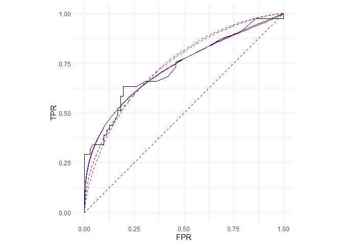

Replication material: Gneiting and Vogel (2021)
================

The following scripts replicate the results shown in Table 1 and Figure
1 from the study by Gneiting and Vogel (2021).

Expected runtime (on an average notebook from 2018, i5-8250U CPU):
approximately 10 minutes.

``` r
library(tidyverse)

devtools::load_all()

data("aSAH_Robin")
data("hiv_Sing")
data("PSA_Etzioni")
data("WS_Vogel")

sessionInfo()
```

    ## R version 4.0.4 (2021-02-15)
    ## Platform: x86_64-w64-mingw32/x64 (64-bit)
    ## Running under: Windows 10 x64 (build 19041)
    ## 
    ## Matrix products: default
    ## 
    ## locale:
    ## [1] LC_COLLATE=English_Germany.1252  LC_CTYPE=English_Germany.1252   
    ## [3] LC_MONETARY=English_Germany.1252 LC_NUMERIC=C                    
    ## [5] LC_TIME=English_Germany.1252    
    ## 
    ## attached base packages:
    ## [1] stats     graphics  grDevices utils     datasets  methods   base     
    ## 
    ## other attached packages:
    ##  [1] betaROC_0.1.0   testthat_3.0.0  forcats_0.5.0   stringr_1.4.0  
    ##  [5] dplyr_1.0.2     purrr_0.3.4     readr_1.4.0     tidyr_1.1.2    
    ##  [9] tibble_3.0.4    ggplot2_3.3.2   tidyverse_1.3.0
    ## 
    ## loaded via a namespace (and not attached):
    ##  [1] Rcpp_1.0.5        lubridate_1.7.9.2 prettyunits_1.1.1 ps_1.4.0         
    ##  [5] assertthat_0.2.1  rprojroot_2.0.2   digest_0.6.27     R6_2.5.0         
    ##  [9] cellranger_1.1.0  backports_1.2.0   reprex_0.3.0      evaluate_0.14    
    ## [13] httr_1.4.2        pillar_1.4.6      rlang_0.4.8       readxl_1.3.1     
    ## [17] rstudioapi_0.13   callr_3.5.1       rmarkdown_2.5     desc_1.2.0       
    ## [21] devtools_2.3.2    munsell_0.5.0     broom_0.7.2       compiler_4.0.4   
    ## [25] modelr_0.1.8      xfun_0.19         pkgconfig_2.0.3   pkgbuild_1.1.0   
    ## [29] htmltools_0.5.0   tidyselect_1.1.0  fansi_0.4.1       crayon_1.3.4     
    ## [33] dbplyr_2.0.0      withr_2.3.0       grid_4.0.4        jsonlite_1.7.1   
    ## [37] gtable_0.3.0      lifecycle_0.2.0   DBI_1.1.0         magrittr_2.0.1   
    ## [41] scales_1.1.1      cli_2.1.0         stringi_1.5.3     fs_1.5.0         
    ## [45] remotes_2.2.0     xml2_1.3.2        ellipsis_0.3.1    generics_0.1.0   
    ## [49] vctrs_0.3.5       tools_4.0.4       glue_1.4.2        hms_0.5.3        
    ## [53] processx_3.4.4    pkgload_1.1.0     yaml_2.2.1        colorspace_2.0-0 
    ## [57] sessioninfo_1.1.1 rvest_0.3.6       memoise_1.1.0     knitr_1.30       
    ## [61] haven_2.3.1       usethis_1.6.3

``` r
empROC <- lapply(
  list(aSAH_Robin, hiv_Sing, PSA_Etzioni, WS_Vogel),
  function(x) {
    roc(obs ~ forc, x)
  })

MDE_info <- list(
  list(method = "bin2p", info = "unrestricted"),
  list(method = "bin2p", info = "concave"),
  list(method = "beta2p", info = "unrestricted"),
  list(method = "beta2p", info = "concave")
)

df <- tibble(
  study = rep(c("Robin", "Sing", "Etzioni", "Vogel"), each = 4),
  empROC = rep(empROC, each = 4),
  MDE_info = rep(MDE_info, times = 4)
) %>%
  mutate(
    params = map2(empROC, MDE_info, fit_MDE)
  )
```

### Etzioni et al. (1999)

Prostate cancer antigen ratio, 116 observations

``` r
df_Etzioni <- filter(df, study == "Etzioni")

with(df_Etzioni, {
  c(
    sprintf("Binormal model - unrestricted"),
    sprintf("Parameters (mu, sigma):     (%.2f, %.2f)",
            params[[1]]$pars_fit[1],
            params[[1]]$pars_fit[2]
    ),
    sprintf("L2-distance:                 %.3f",
            params[[1]]$L2_fit),
    
    sprintf("Binormal model - concave"),
    sprintf("Parameters (mu, sigma):     (%.2f, %.2f)",
            params[[2]]$pars_fit[1],
            params[[2]]$pars_fit[2]
    ),
    sprintf("L2-distance:                 %.3f",
            params[[2]]$L2_fit),
    
    sprintf("Beta model - unrestricted"),
    sprintf("Parameters (alpha, beta):   (%.2f, %.2f)",
            params[[3]]$pars_fit[1],
            params[[3]]$pars_fit[2]
    ),
    sprintf("L2-distance:                 %.3f",
            params[[3]]$L2_fit),
    
    sprintf("Beta model - concave"),
    sprintf("Parameters (alpha, beta):   (%.2f, %.2f)",
            params[[4]]$pars_fit[1],
            params[[4]]$pars_fit[2]
    ),
    sprintf("L2-distance:                 %.3f",
            params[[4]]$L2_fit)
  )
}) %>%
  cat(sep = "\n")
```

    ## Binormal model - unrestricted
    ## Parameters (mu, sigma):     (1.05, 0.78)
    ## L2-distance:                 0.043
    ## Binormal model - concave
    ## Parameters (mu, sigma):     (1.22, 1.00)
    ## L2-distance:                 0.056
    ## Beta model - unrestricted
    ## Parameters (alpha, beta):   (0.34, 1.32)
    ## L2-distance:                 0.042
    ## Beta model - concave
    ## Parameters (alpha, beta):   (0.39, 1.61)
    ## L2-distance:                 0.045

``` r
with(df_Etzioni, {
  p <- plot_roc_empirical(empROC[[1]])
  p <- plot_binormal(params[[1]]$pars_fit, MDE_info[[1]], p, color = "red")
  p <- plot_binormal(params[[2]]$pars_fit, MDE_info[[2]], p, lty = 2, color = "red")
  p <- plot_beta(params[[3]]$pars_fit, MDE_info[[3]], p, color = "blue")
  p <- plot_beta(params[[4]]$pars_fit, MDE_info[[4]], p, lty = 2, color = "blue")
  p +
    theme(aspect.ratio = 1) +
    geom_segment(mapping = aes(x = 0, xend = 1, y = 0, yend = 1), lty = 2)
})
```

<!-- -->

Empirical (black), fitted binormal (red) and fitted beta (blue) ROC
curves in the unrestricted (solid) and concave (dashed) case.

### Sing et al. (2005)

Coreceptor usage SVM predictor, 3450 observations

    ## Binormal model - unrestricted
    ## Parameters (mu, sigma):     (1.58, 0.65)
    ## L2-distance:                 0.019
    ## Binormal model - concave
    ## Parameters (mu, sigma):     (2.05, 1.00)
    ## L2-distance:                 0.039
    ## Beta model - unrestricted
    ## Parameters (alpha, beta):   (0.15, 1.44)
    ## L2-distance:                 0.023
    ## Beta model - concave
    ## Parameters (alpha, beta):   (0.17, 1.83)
    ## L2-distance:                 0.025

<!-- -->

Empirical (black), fitted binormal (red) and fitted beta (blue) ROC
curves in the unrestricted (solid) and concave (dashed) case.

### Robin et al. (2011)

Clinical outcome S100\(\beta\) concentration, 113 observations

    ## Binormal model - unrestricted
    ## Parameters (mu, sigma):     (0.75, 0.72)
    ## L2-distance:                 0.033
    ## Binormal model - concave
    ## Parameters (mu, sigma):     (0.91, 1.00)
    ## L2-distance:                 0.060
    ## Beta model - unrestricted
    ## Parameters (alpha, beta):   (0.36, 0.96)
    ## L2-distance:                 0.032
    ## Beta model - concave
    ## Parameters (alpha, beta):   (0.52, 1.48)
    ## L2-distance:                 0.050

<!-- -->

Empirical (black), fitted binormal (red) and fitted beta (blue) ROC
curves in the unrestricted (solid) and concave (dashed) case.

### Vogel et al. (2018)

Precipitation NWP forecast, 5449 observations

    ## Binormal model - unrestricted
    ## Parameters (mu, sigma):     (1.13, 1.22)
    ## L2-distance:                 0.008
    ## Binormal model - concave
    ## Parameters (mu, sigma):     (0.99, 1.00)
    ## L2-distance:                 0.031
    ## Beta model - unrestricted
    ## Parameters (alpha, beta):   (0.79, 2.57)
    ## L2-distance:                 0.006
    ## Beta model - concave
    ## Parameters (alpha, beta):   (0.79, 2.57)
    ## L2-distance:                 0.006

<!-- -->

Empirical (black), fitted binormal (red) and fitted beta (blue) ROC
curves in the unrestricted (solid) and concave (dashed) case.
