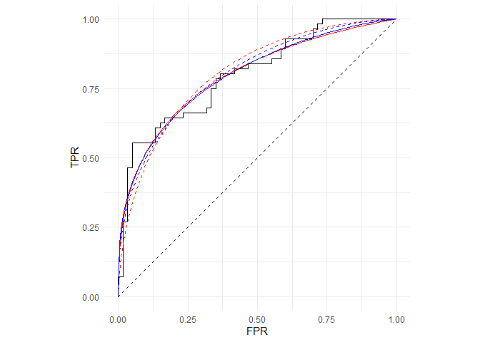
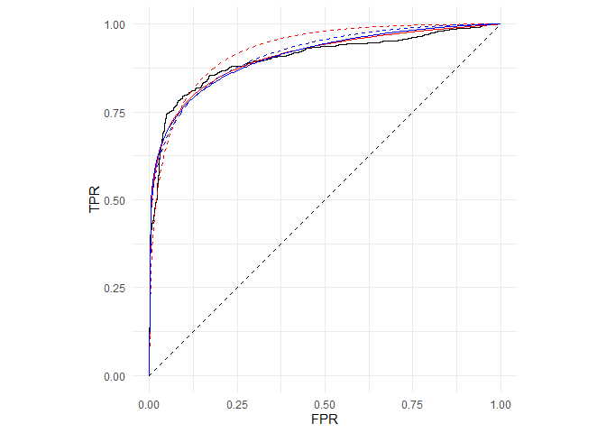
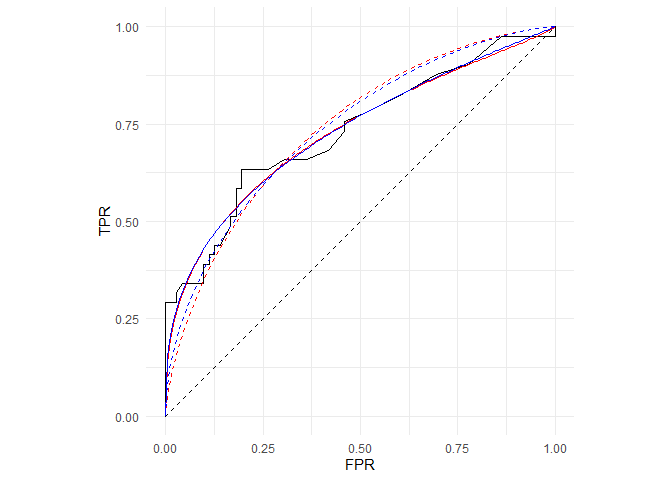
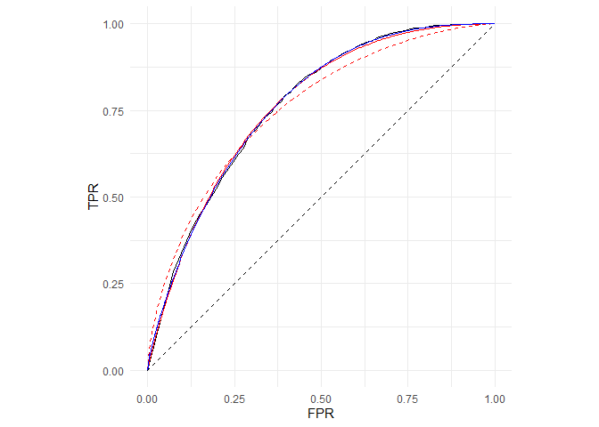

Replication material: Gneiting and Vogel (2021)
================

The following scripts replicate the results shown in Table 1 and Figure
1 from the study by Gneiting and Vogel (2021).

``` r
library(tidyverse)

devtools::load_all()

data("aSAH_Robin")
data("hiv_Sing")
data("PSA_Etzioni")
data("WS_Vogel")

sessionInfo()
```

    ## R version 4.0.4 (2021-02-15)
    ## Platform: x86_64-w64-mingw32/x64 (64-bit)
    ## Running under: Windows 10 x64 (build 19042)
    ## 
    ## Matrix products: default
    ## 
    ## locale:
    ## [1] LC_COLLATE=English_United States.1252 
    ## [2] LC_CTYPE=English_United States.1252   
    ## [3] LC_MONETARY=English_United States.1252
    ## [4] LC_NUMERIC=C                          
    ## [5] LC_TIME=English_United States.1252    
    ## 
    ## attached base packages:
    ## [1] stats     graphics  grDevices utils     datasets  methods   base     
    ## 
    ## other attached packages:
    ##  [1] betaROC_0.1.0   testthat_3.0.2  forcats_0.5.1   stringr_1.4.0  
    ##  [5] dplyr_1.0.5     purrr_0.3.4     readr_1.4.0     tidyr_1.1.3    
    ##  [9] tibble_3.1.0    ggplot2_3.3.3   tidyverse_1.3.0
    ## 
    ## loaded via a namespace (and not attached):
    ##  [1] Rcpp_1.0.6        lubridate_1.7.10  prettyunits_1.1.1 ps_1.6.0         
    ##  [5] rprojroot_2.0.2   assertthat_0.2.1  digest_0.6.27     utf8_1.1.4       
    ##  [9] R6_2.5.0          cellranger_1.1.0  backports_1.2.1   reprex_1.0.0     
    ## [13] evaluate_0.14     httr_1.4.2        pillar_1.5.1      rlang_0.4.10     
    ## [17] readxl_1.3.1      rstudioapi_0.13   callr_3.5.1       rmarkdown_2.7    
    ## [21] desc_1.3.0        devtools_2.3.2    munsell_0.5.0     broom_0.7.5      
    ## [25] compiler_4.0.4    modelr_0.1.8      xfun_0.22         pkgconfig_2.0.3  
    ## [29] pkgbuild_1.2.0    htmltools_0.5.1.1 tidyselect_1.1.0  fansi_0.4.2      
    ## [33] crayon_1.4.1      dbplyr_2.1.0      withr_2.4.1       grid_4.0.4       
    ## [37] jsonlite_1.7.2    gtable_0.3.0      lifecycle_1.0.0   DBI_1.1.1        
    ## [41] magrittr_2.0.1    scales_1.1.1      cli_2.3.1         stringi_1.5.3    
    ## [45] cachem_1.0.4      remotes_2.2.0     fs_1.5.0          xml2_1.3.2       
    ## [49] ellipsis_0.3.1    generics_0.1.0    vctrs_0.3.6       tools_4.0.4      
    ## [53] glue_1.4.2        hms_1.0.0         processx_3.4.5    pkgload_1.2.0    
    ## [57] fastmap_1.1.0     yaml_2.2.1        colorspace_2.0-0  sessioninfo_1.1.1
    ## [61] rvest_1.0.0       memoise_2.0.0     knitr_1.31        haven_2.3.1      
    ## [65] usethis_2.0.1

``` r
empROC <- lapply(
  list(aSAH_Robin, hiv_Sing, PSA_Etzioni, WS_Vogel),
  function(x) {
    roc(obs ~ forc, x)
  })

MDE_info <- list(
  list(method = "bin2p", info = "unrestricted"),
  list(method = "bin2p", info = "concave"),
  list(method = "beta2p", info = "unrestricted"),
  list(method = "beta2p", info = "concave")
)

df <- tibble(
  study = rep(c("Robin", "Sing", "Etzioni", "Vogel"), each = 4),
  empROC = rep(empROC, each = 4),
  MDE_info = rep(MDE_info, times = 4)
) %>%
  mutate(
    params = map2(empROC, MDE_info, MDE)
  )
```

The following script file runs the Monte Carlo goodness-of-fit test for
each data set and parametric model, and saves them in the subfolder
“goodness\_of\_fit\_files”. For the smaller data sets the runtime can be
less than one minute, whereas the runtime for larger the data sets can
be up to around one hour. These runtimes have been recorded on notebook
with an Intel(R) Core(TM) i7-10810U processor.

``` r
source("goodness_of_fit.R")
```

``` r
df$pvalue <- map2(df$study, df$MDE_info, function(study, MDE_info) {
  filename <- sprintf("goodness_of_fit_files/%s_%s_%s.RData",
                      study, MDE_info$method, MDE_info$info)
  load(filename)
  results$pval
})
```

The following functions are used to print and plot the results.

``` r
format_results <- function(df) {
  with(df, {
    c(
      sprintf("Binormal model - unrestricted"),
      sprintf("Parameters (mu, sigma):     (%.2f, %.2f)",
              params[[1]]$pars_fit[1], params[[1]]$pars_fit[2]),
      sprintf("L2-distance:                 %.3f",
              params[[1]]$L2_fit),
      sprintf("P-value:                     %.3f",
              pvalue[1]),
      
      sprintf("Binormal model - concave"),
      sprintf("Parameters (mu, sigma):     (%.2f, %.2f)",
              params[[2]]$pars_fit[1], params[[2]]$pars_fit[2]),
      sprintf("L2-distance:                 %.3f",
              params[[2]]$L2_fit),
      sprintf("P-value:                     %.3f",
              pvalue[2]),
      
      sprintf("Beta model - unrestricted"),
      sprintf("Parameters (alpha, beta):   (%.2f, %.2f)",
              params[[3]]$pars_fit[1], params[[3]]$pars_fit[2]),
      sprintf("L2-distance:                 %.3f",
              params[[3]]$L2_fit),
      sprintf("P-value:                     %.3f",
              pvalue[3]),
    
      sprintf("Beta model - concave"),
      sprintf("Parameters (alpha, beta):   (%.2f, %.2f)",
              params[[4]]$pars_fit[1], params[[4]]$pars_fit[2]),
      sprintf("L2-distance:                 %.3f",
              params[[4]]$L2_fit),
      sprintf("P-value:                     %.3f",
              pvalue[4])
    )
  }) %>%
    cat(sep = "\n")
}

plot_results <- function(df_study) {
  with(df_study, {
    p <- plot_roc_empirical(empROC[[1]])
    p <- plot_binormal(params[[1]]$pars_fit, MDE_info[[1]], p,
                       color = "red")
    p <- plot_binormal(params[[2]]$pars_fit, MDE_info[[2]], p,
                       lty = 2, color = "red")
    p <- plot_beta(params[[3]]$pars_fit, MDE_info[[3]], p,
                   color = "blue")
    p <- plot_beta(params[[4]]$pars_fit, MDE_info[[4]], p,
                   lty = 2, color = "blue")
    p +
      theme(aspect.ratio = 1) +
      geom_segment(mapping = aes(x = 0, xend = 1, y = 0, yend = 1), lty = 2)
  })
}
```

### Etzioni et al. (1999)

Prostate cancer antigen ratio, 116 observations

``` r
df_Etzioni <- filter(df, study == "Etzioni")

format_results(df_Etzioni)
```

    ## Binormal model - unrestricted
    ## Parameters (mu, sigma):     (1.05, 0.78)
    ## L2-distance:                 0.043
    ## P-value:                     0.109
    ## Binormal model - concave
    ## Parameters (mu, sigma):     (1.22, 1.00)
    ## L2-distance:                 0.056
    ## P-value:                     0.125
    ## Beta model - unrestricted
    ## Parameters (alpha, beta):   (0.34, 1.32)
    ## L2-distance:                 0.042
    ## P-value:                     0.121
    ## Beta model - concave
    ## Parameters (alpha, beta):   (0.39, 1.61)
    ## L2-distance:                 0.045
    ## P-value:                     0.332

``` r
plot_results(df_Etzioni)
```

<!-- -->

Empirical (black), fitted binormal (red) and fitted beta (blue) ROC
curves in the unrestricted (solid) and concave (dashed) case.

### Sing et al. (2005)

Coreceptor usage SVM predictor, 3450 observations

``` r
df_Sing <- filter(df, study == "Sing")

format_results(df_Sing)
```

    ## Binormal model - unrestricted
    ## Parameters (mu, sigma):     (1.58, 0.65)
    ## L2-distance:                 0.019
    ## P-value:                     0.001
    ## Binormal model - concave
    ## Parameters (mu, sigma):     (2.05, 1.00)
    ## L2-distance:                 0.039
    ## P-value:                     0.785
    ## Beta model - unrestricted
    ## Parameters (alpha, beta):   (0.15, 1.44)
    ## L2-distance:                 0.023
    ## P-value:                     0.001
    ## Beta model - concave
    ## Parameters (alpha, beta):   (0.17, 1.83)
    ## L2-distance:                 0.025
    ## P-value:                     0.326

``` r
plot_results(df_Sing)
```

<!-- -->

Empirical (black), fitted binormal (red) and fitted beta (blue) ROC
curves in the unrestricted (solid) and concave (dashed) case.

### Robin et al. (2011)

Clinical outcome S100*β* concentration, 113 observations

``` r
df_Robin <- filter(df, study == "Robin")

format_results(df_Robin)
```

    ## Binormal model - unrestricted
    ## Parameters (mu, sigma):     (0.75, 0.72)
    ## L2-distance:                 0.033
    ## P-value:                     0.593
    ## Binormal model - concave
    ## Parameters (mu, sigma):     (0.91, 1.00)
    ## L2-distance:                 0.060
    ## P-value:                     0.114
    ## Beta model - unrestricted
    ## Parameters (alpha, beta):   (0.36, 0.96)
    ## L2-distance:                 0.032
    ## P-value:                     0.635
    ## Beta model - concave
    ## Parameters (alpha, beta):   (0.52, 1.48)
    ## L2-distance:                 0.050
    ## P-value:                     0.327

``` r
plot_results(df_Robin)
```

<!-- -->

Empirical (black), fitted binormal (red) and fitted beta (blue) ROC
curves in the unrestricted (solid) and concave (dashed) case.

### Vogel et al. (2018)

Precipitation NWP forecast, 5449 observations

``` r
df_Vogel <- filter(df, study == "Vogel")

format_results(df_Vogel)
```

    ## Binormal model - unrestricted
    ## Parameters (mu, sigma):     (1.13, 1.22)
    ## L2-distance:                 0.008
    ## P-value:                     0.031
    ## Binormal model - concave
    ## Parameters (mu, sigma):     (0.99, 1.00)
    ## L2-distance:                 0.031
    ## P-value:                     0.001
    ## Beta model - unrestricted
    ## Parameters (alpha, beta):   (0.79, 2.57)
    ## L2-distance:                 0.006
    ## P-value:                     0.158
    ## Beta model - concave
    ## Parameters (alpha, beta):   (0.79, 2.57)
    ## L2-distance:                 0.006
    ## P-value:                     0.399

``` r
plot_results(df_Vogel)
```

<!-- -->

Empirical (black), fitted binormal (red) and fitted beta (blue) ROC
curves in the unrestricted (solid) and concave (dashed) case.
